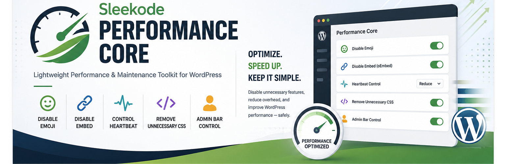
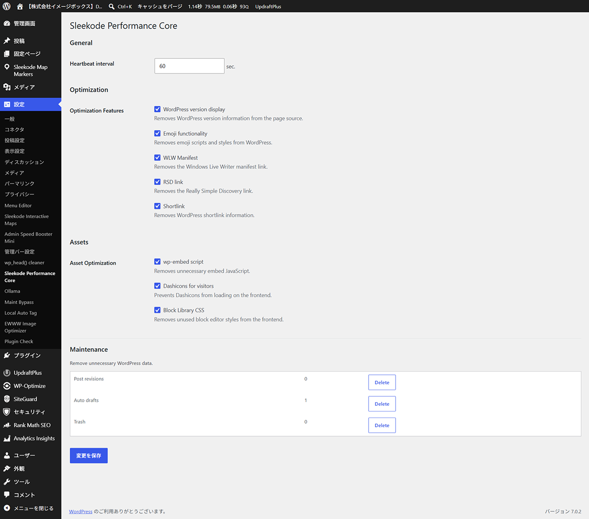
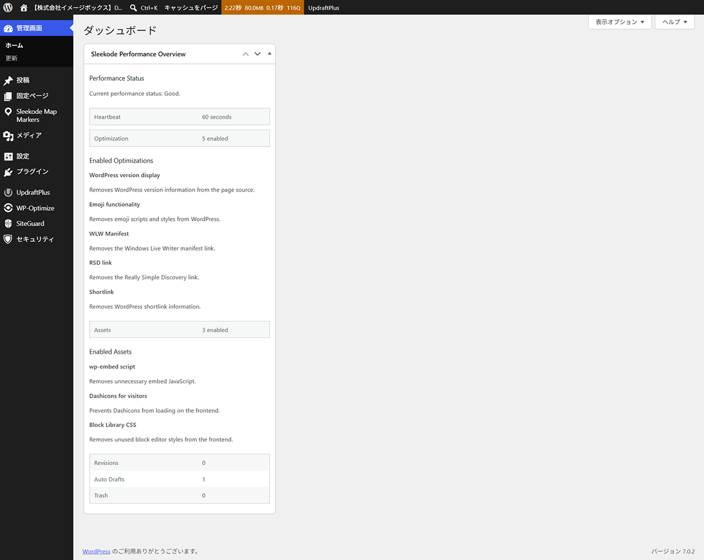
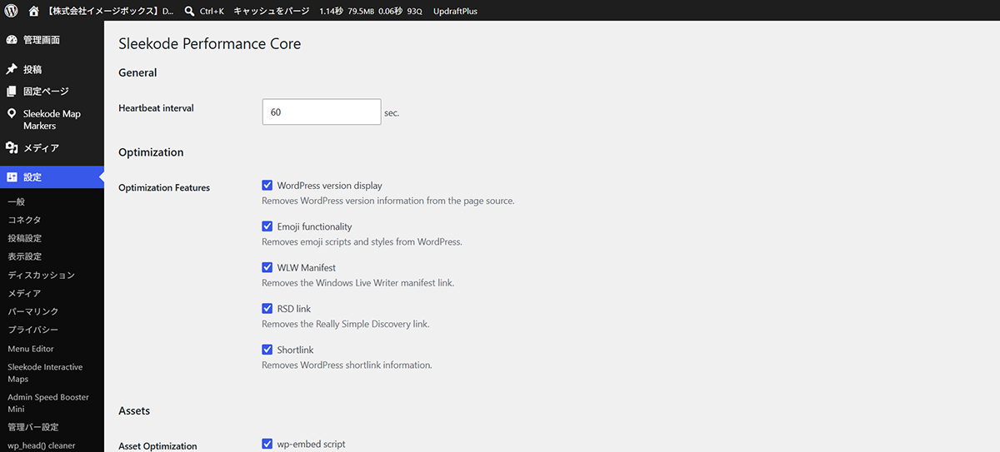
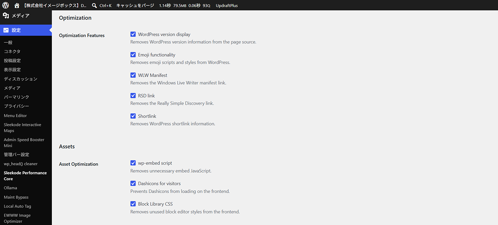

# Sleekode Chrono Snap

Official WordPress Plugin:

https://wordpress.org/plugins/sleekode-performance-core

Sleekode Performance Core is a lightweight performance optimization plugin for WordPress.

It provides simple controls for disabling unnecessary WordPress features and improving overall site performance without modifying your content or database.

The plugin uses only standard WordPress APIs and does not connect to any external services.

## ✨ Features

- Disable WordPress Emoji scripts and styles.
- Disable WordPress Embed (oEmbed).
- Control the WordPress Heartbeat API.
- Remove unnecessary front-end CSS.
- Show or hide the WordPress Admin Bar.
- Simple and lightweight settings screen.
- Safe operation using WordPress standard APIs.

## 📷 Screenshots

| Settings page for enabling and disabling performance features. | Dashboard widget showing current optimization status. |
|-----------|---------------|
|  |  |

| Heartbeat API control options. | Front-end optimization settings. |
|-----------|---------------|
|  |  |

## 🚀 Installation

Install from the official WordPress Plugin Directory:

https://wordpress.org/plugins/sleekode-performance-core

1. Upload the plugin to the `/wp-content/plugins/` directory, or install it through the WordPress Plugins screen.
2. Activate the plugin.
3. Open **settings → Performance Core**.
4. Enable the features you want to use.

## 📖 Documentation

Documentation is currently being prepared.

For support, bug reports, or feature requests, please use:

https://github.com/Sleekode/sleekode-performance-core/issues

## 🤝 Contributing

Bug reports, feature requests, and pull requests are welcome.

If you find an issue, please open an Issue before submitting a Pull Request.

## 📋 Changelog

### 1.0.0
- Initial release.
- Added Emoji control.
- Added Embed control.
- Added Heartbeat control.
- Added front-end CSS optimization.
- Added Admin Bar control.
- Added dashboard widget.

## 🔔 Upgrade Notice

### 1.0.0

Initial release.

## 📄 License

This program is free software; you can redistribute it and/or modify it under the terms of the GNU General Public License as published by the Free Software Foundation; either version 2 of the License, or (at your option) any later version.
